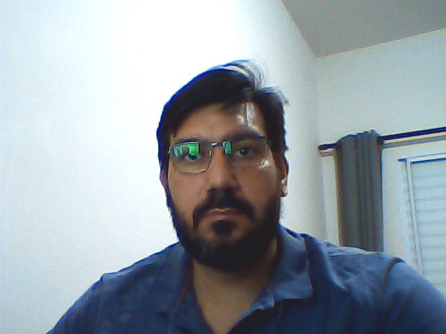

# Bruno M. Serra

Sou um profissional em transição de carreira, aproveitando a oportunidade de estar na faculdade novamente para me aprimorar e me desenvolver na área de tecnologia. Estou em busca de novos desafios e conhecimentos.

Atualmente, moro em Presidente Prudente e estou cursando o terceiro termo na FATEC - Presidente Prudente. Embora não tenha experiência profissional na área, adquiri conhecimentos básicos na disciplina de: HTML e CSS, lógica e algoritmos, utilizando a linguagem Python, e estou aprendendo C# na disciplina de Estruturas de Dados.

Em relação aos meus hobbies acadêmicos, participei de uma comunidade sobre Arduino/C++, porem parece que a comunidade não vingou.

Nos meus momentos de lazer, pratico esportes como futebol, natação e ciclismo. No entanto, devido à correria do dia a dia, não tenho conseguido me dedicar tanto. Gosto de relaxar com um tereré bem gelado e aproveitar um bom churrasco.

Participando do programa de bolsas da CompassUol, venho adquirindo conhecimento e me desenvolvendo com experiências novas seguindo o cronograma de sprints... 
Vamos conferir o progresso:

# Progresso no programa de bolsa compass

- [x] [Sprint_01](/Sprint_01/)
- [x] [Sprint_02](/Sprint_02/)
- [x] [Sprint_03](/Sprint_03/)
- [x] [Sprint_04](/Sprint_04/)
- [x] [Sprint_05](/Sprint_05/)
- [x] [Sprint_06](/Sprint_06/)
- [x] [Sprint_07](/Sprint_07/)
- [x] [Sprint_08](/Sprint_08/)
- [x] [Sprint_09](/Sprint_09/)
- [x] [Sprint_10](/Sprint_10/)

