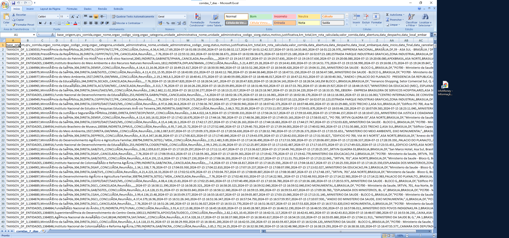
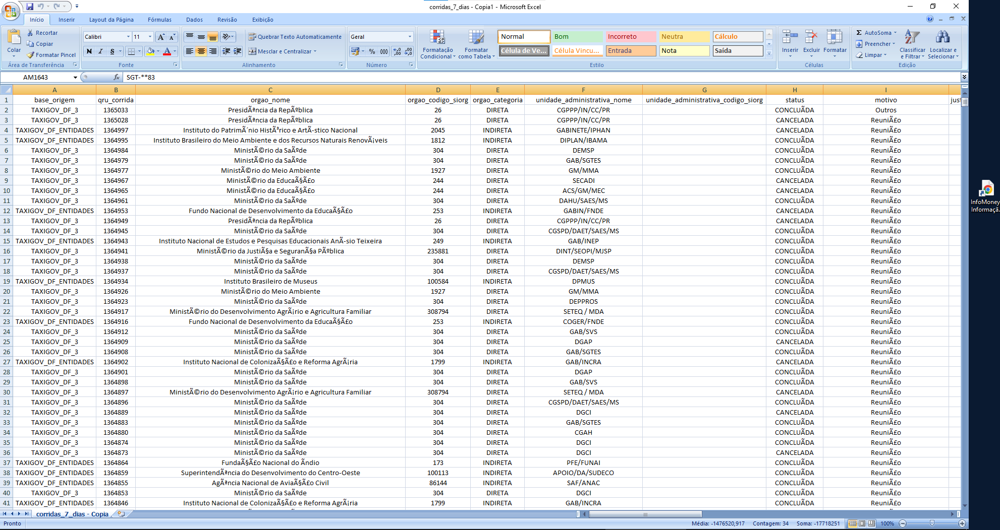
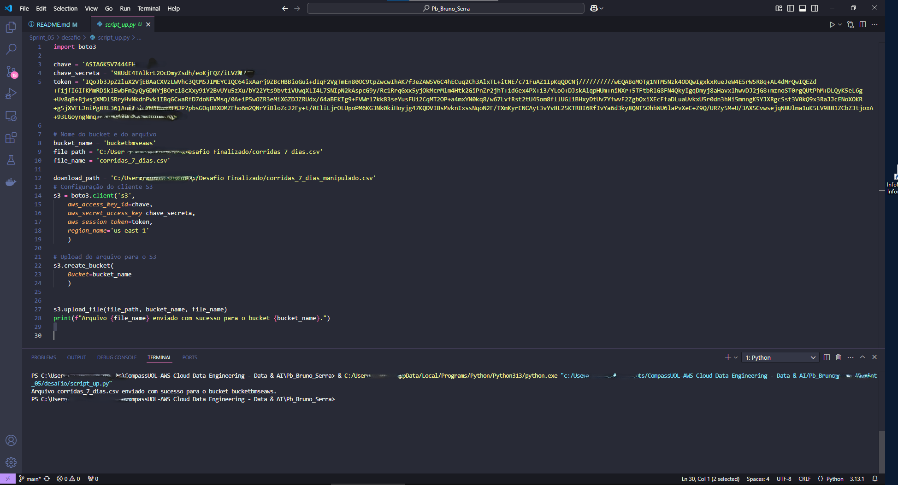
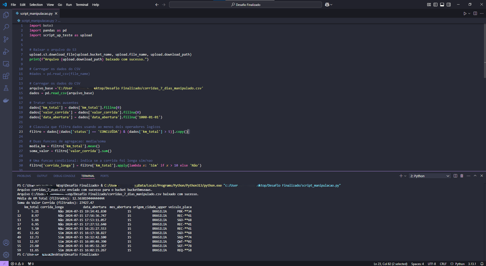
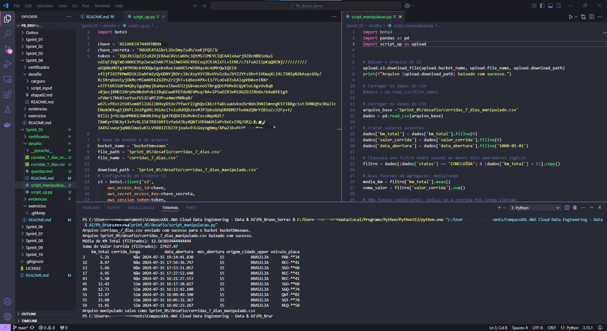

# Desafio sprint_05

### Objetivo

Familiarização com a linguagem python, biblioteca pandas e boto3, aprendendo sobre o ambiente Aws e a utilização dos comandos,para upload, download e criação e execução de buckets no ambiente Aws.

### Descrição

Desenvolver script para realizar upload de arquivos e download dos arquivos de bucket no s3 da Aws, para simular e gerar experiências próximas da realidade, para aprendizado sobre os assuntos. Entregar tudo de maneira organizada no repositório do github.

### Etapas para realização do desafio

* Assistir as trilhas sobre o conteúdo
* Baixar arquivos necessários
* Criar e desenvolver o script em python
* Utilizar bibliotecas solicitadas (pandas, boto3)
* Rodar o script, com comandos do s3, pela maquina local
* Realizar teste e verificar as funcionalidades 
* Finalizar arquivo e estruturas a serem entregues
* Finalizar no repositório do github

### Construção do desafio
Iniciei a construção do desafio preparando e desenvolvendo um esboço do programa.
Neste esboço, gerei o arquivo questão.md com o que era mais relevante para desenvolver o desafio e a partir desse texto, comecei o desenvolvimento do script.

### Etapa01 - Busca da base de dados

A busca da base de dados foi realizada no site dados.gov.br, e a base que mais se enquadrou a meu ver para realização do desafio foi o sistema de transporte de servidores públicos taxigov v2
dentro dessa base de dados existem alguns recursos e um dele foi o recurso dos últimos 7 dias 
segue o link:
* [base de dados](https://dados.gov.br/dados/conjuntos-dados/sistema-de-transportes-de-servidores-publicos---taxigov-v2)

e o link do arquivo para download e:

* [Download base de dados](https://repositorio.dados.gov.br/seges/taxigov/v2/taxigov-corridas-7-dias.zip)

Print da base de dado:

Apenas para verificação da base de dados alternei a visualização para maior clareza:

Etapa 01 finalizada!!!
----------------------------------------------------------------------------

### Etapa02 - Script upload

Foi solicitado a criação de um arquivo para iniciar um bucket, e realizar o upload do arquivo original, e junto com esse script, as credencias da aws, para que o acesso e a inicialização do bucket ocorresse tudo bem, sendo utilizado a biblioteca boto3.

segue o script de upload:

* [Script upload](script_up.py)

Segue o resultado do script executado:

Etapa 02 finalizada!!!
----------------------------------------------------------------------------
### Etapa03  Manipulação, resultado e upload do arquivo modificado

Foi desenvolvido um script, onde ocorreu a manipulação da base de dados, e onde foi resolvidos os itens cobrados, logo após a resolução dos questionamentos, foi gerado um resultados, para gerar os resultados foi utilizados biblioteca pandas, assim foi realizado o upload dos arquivos para o servidos s3 Aws, utilizando a biblioteca boto3. Segue o script:

* [Script Manipulação](script_manipulacao.py)

Segue o resultado do script executado:

obs: As manipulações seguiram as questões contidas no:

* [Questão](questao.md)

Etapa 03 finalizada

Imagem do script rodando dentro da pasta do desafio

----------------------------------------------------------------------------

Conforme foi informado as credencias da aws era pra ser trocadas por outras Id-chaves
realiza agora ante de upar ao repositório

