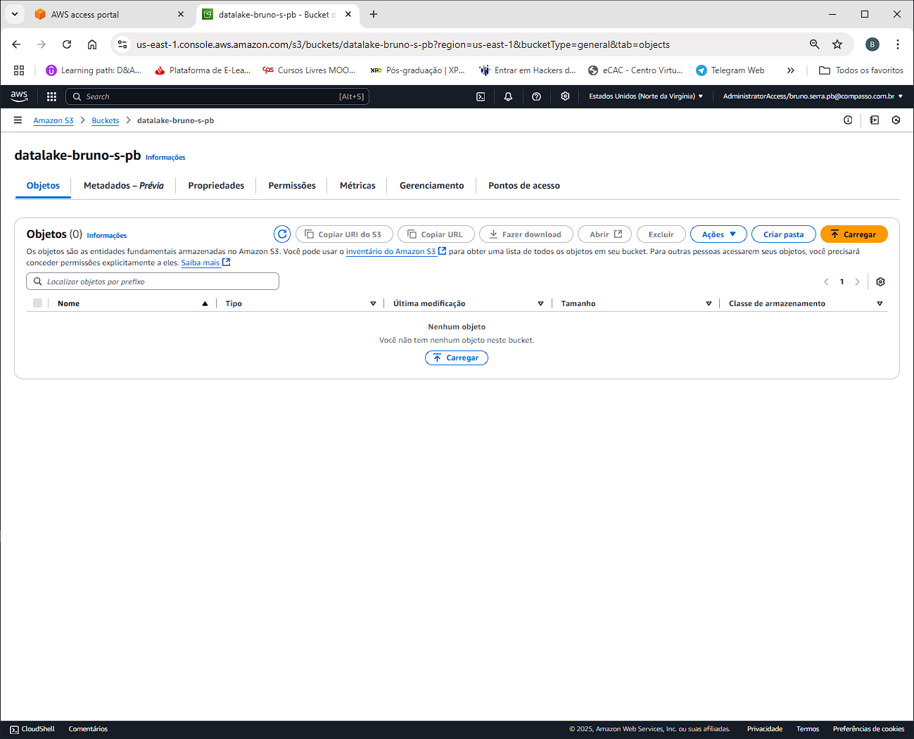
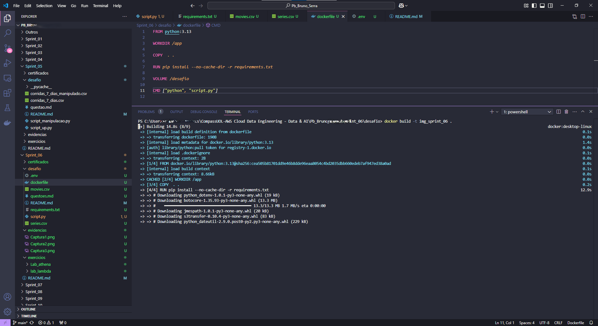
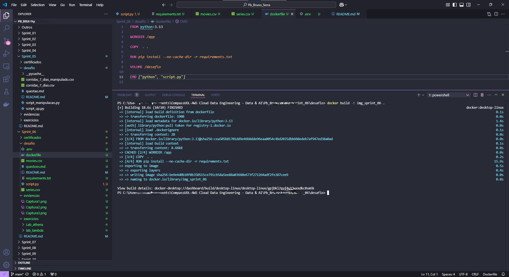
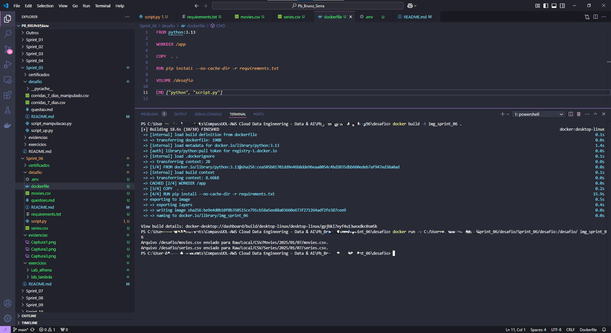
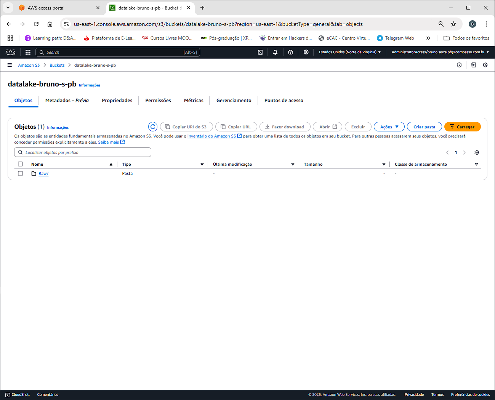
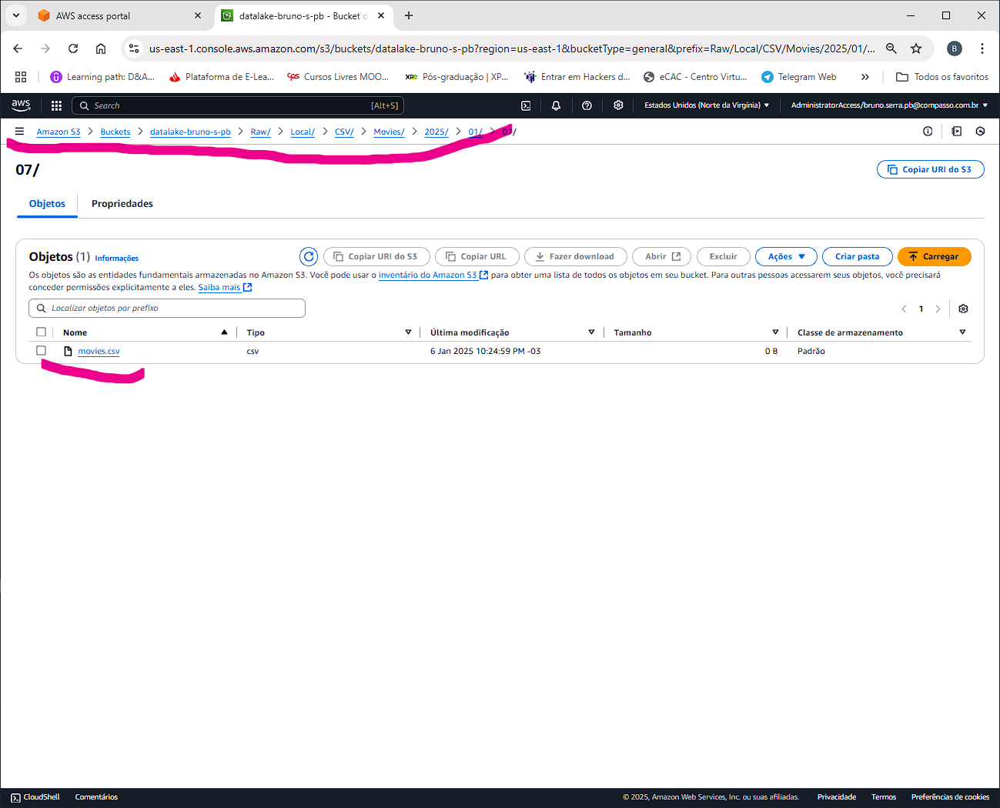

# Desafio sprint_06

### Objetivo

Familiarização com a linguagem python, biblioteca pandas e boto3, laboratório aws athenas, lambda e o manipulação de arquivos no aws s3.
Aprendendo sobre o ambiente Aws e a utilização dos comandos, para upload, download e criação e execução de buckets no ambiente Aws e a criação de contêiner.

### Descrição

Desenvolver script para realizar upload de arquivos e no bucket na s3 da Aws, para simular e gerar experiências próximas da realidade, para aprendizado sobre os assuntos. Entregar tudo de maneira organizada no repositório do github.

### Etapas para realização do desafio

* Assistir as trilhas sobre o conteúdo
* Baixar arquivos necessários
* Criar questões para uso no decorrer da sprints
* Criar e desenvolver o script em python
* Utilizar bibliotecas solicitadas (, boto3)
* Rodar o script, com comandos do s3, pela maquina local.
* Realizar teste e verificar as funcionalidades 
* Finalizar arquivo e estruturas a serem entregues
* Finalizar no repositório do github

### Construção das Questões

Criado um arquivo contendo as 4 questões para manipulação de banco de dados e a entrega de resultados na próximas sprints
* [Questões](../desafio/questoes.md)

### Construção do desafio
Iniciei a construção do desafio preparando e desenvolvendo um esboço do programa.
Neste esboço, gerei o arquivo script.py com o que era mais relevante para desenvolver o desafio e a partir desse texto, comecei o desenvolvimento do script.

### Etapa01 

Foi criado o arquivo script.py onde contem os códigos responsáveis pela transferências de arquivos, para o aws s3. junto a este arquivo foi criado o arquivo .env que contém as credenciais da aws, para podes manipular a conta. (este arquivo ele foi altera para que as credencias fosse mantido em segurança. no local da mesma foi adicionado: id_xxx)

Desenvolvido também um arquivo dockerfile, e um arquivo requirements.txt, ambos contendo instruções para que fosse possível a criação da imagem e posteriormente o contêiner do docker.
O código após inicializado e rodado fazendo assim o upload do arquivos mantendo as estruturas de pasta/caminho conforme solicitado nas descrições do desafio.

Os arquivos que foram usados para desenvolver o desafio 

* [script](script.py)

* [Arquivo docker](dockerfile)

* [movies.csv](movies.csv)

* [requirements.txt](requirements.txt)

* [series.csv](series.csv)

e os comando utilizados para criar a imagem do contêiner:

docker build -t img_sprint_06 .

e o comando para criar o contêiner:

docker run -v C:/Users/BrunoS/Desktop/Sprint_06/desafio/Sprint_06/desafio:/desafio/ img_sprint_06

obs.
Os arquivos de base de dados, conforme não foi solicitado não foram enviados ao github, pois apresentava problemas de espaço/armazenamento. para facilitar o desenvolvimento do desafio, o arquivo foi alterado e dentro dos mesmo não ontem dados. dessa maneira em possível realizar o desafio e enviar o mesmo sem problemas.

----------------------------------------------------------------------------

### Etapa02 - Script rodando

Segue as evidencias do script rodando:

Bucket na s3 criado e vazio (datalake-bruno-s-pb):

Criando a imagem docker:

A imagem finalizada

Criando o contêiner e realizando o upload dos arquivos:

Bucket s3 com os arquivos ja carregados:

Estruturas de pasta conforme o solicitado:

Dando ênfase na estrutura e nas pasta conforme a data atual.(código permite isso)

###Desafio finalizado!!!
